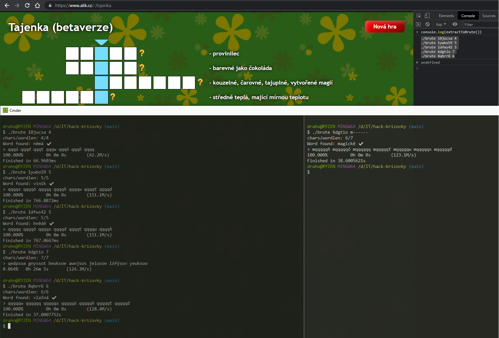

## Tool to find word from the murmur3 hash

### Install
[Install Go](https://golang.org/doc/install)
```bash
go get -u -v github.com/drahoslove/brute
cd `go env GOPATH`/bin
```

### Usage
```
./brute <hash> <len>
./brute <hash> <template>
```



### Notes
- Only work for words consisting of following lowercase characters
`oenatvsilkrdpímuázjyěcbéhřýžčšůfgúňxťóďwq` and space
- the hash is 32bit version of murmur3 encoded using base36
- intended to be run in interactive shell


### Examples
```bash 
# Find 5 characters long word
./brute 1ywbo59 5
```

```bash 
# Find 7 characters long word which starts by letter m
./brute 6dgtio m------
```

```bash
# Find pair of words with some known letter (must be quoted because of the space)
./brute 12151af 't--dn- -n--a'
```

```bash
# Use custom number of workers (should not be more than the number of CPU threads)
# default is threads/2 - 1, but at least 2
WORKERS=15 ./brute 6dgtio 7
```

### Performance (Ryzen 7 - 8 cores - 3.7GHz):
 - 5 chars: ~150 million tries per second
 - 6 chars: ~135 million tries per second
 - 7 chars: ~120 million tries per second
 - 8 chars: ~105 million tries per second
